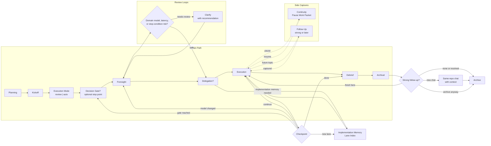

# Workflow Etiquette Flow

Metadata:

- ID: `workflow-etiquette-flow-2026-07-04`
- Feature: `workflow-etiquette`
- Source thread/title: `p1 - Indexed implementation context docs`
- Tags: `gauntlet`, `etiquette`, `planning`, `execution`, `archive`, `execution-mode`, `decision-gate`, `follow-up`
- Related files: `docs/workflow-etiquette.md`

Purpose: show the current workflow-etiquette loop from planning through archival, including review/autonomous execution mode, decision gates, delegation, follow-up strength, and pause/reentry.

